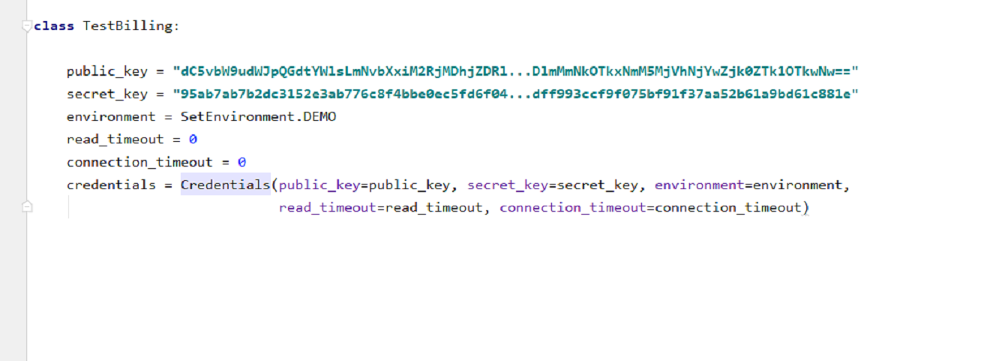
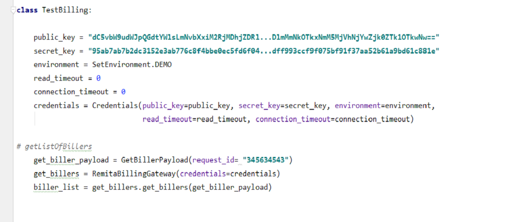
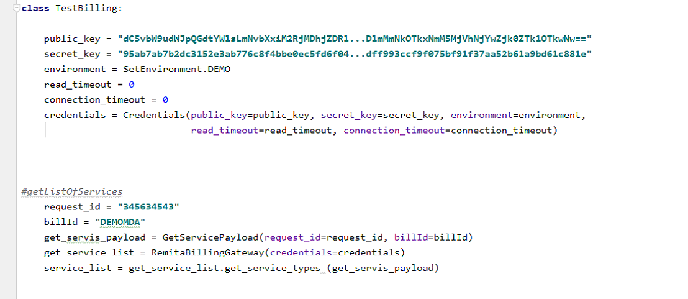
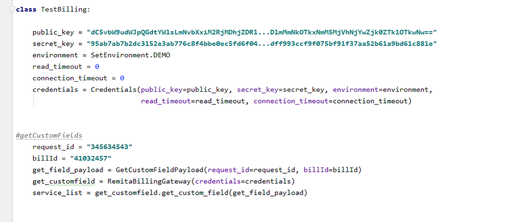
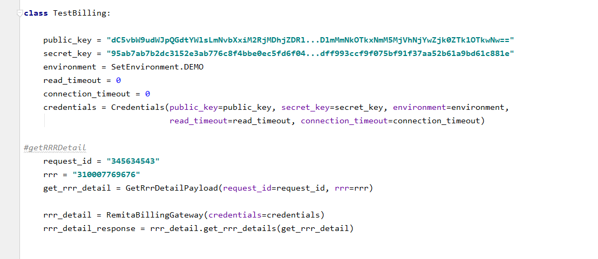
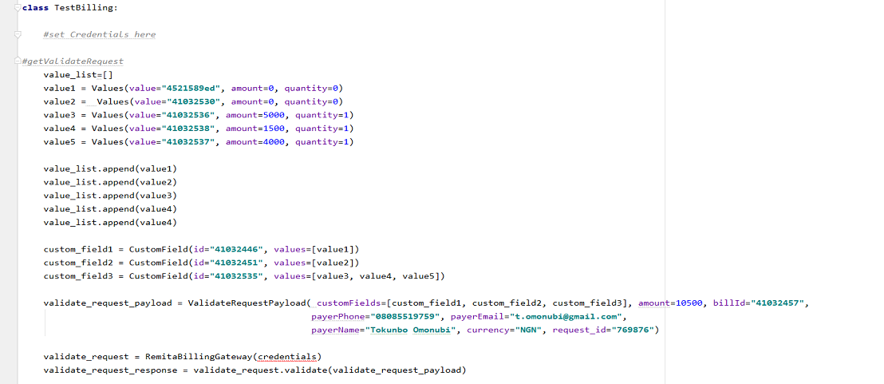
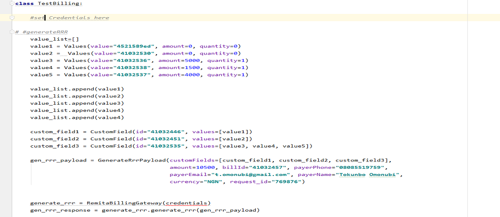
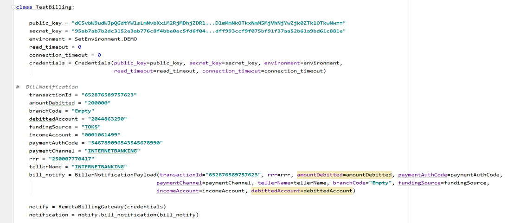

# REMITA BILLER SDK PYTHON
Python SDK for Remita Billing Gateway Service simple APIs

## Package 
To install the `billing-gateway-sdk-python` package, run the following command.

```
pip install billing-gateway-sdk-python
```
## Requirements
*  Python 3.4 or later

## Overview
Integrating to Remita for Biller payments SDK enables your customers make payments to billers on Remita through your platform. This provides you with the capability to offer your customers access to the vast array of billers and merchants, including schools, churches, service providers and the Federal Government ministries, departments and agencies (MDAs) available on Remita to purchase and subscribe to their various products and services.

The process involves your customers selecting a biller to pay via your platform. They will supply payment details and confirm the details so you can debit their account with AmountDue to credit a designated Funds Holding Account. Your customers will be emailed Remita receipts (which are FGN MDA-recognized for TSA-bound payments) for each transaction.

## Prerequisites
Prior to using the SDK, you need to set up an integration profile on [Remita](https://login.remita.net) if you are not already registered as a merchant/biller on the platform. Each method call will require you to pass the Public key/Secret key. Your public and secret keys are located at the Billing page on your profile. After you login, click ‘Setup Billing’ at your dashboard >> click ‘Proceed’ on the ‘Yes’ option for the integration question that comes up >> to display the Public/Secret key.

## Configuration
All biller credentials needed to use the SDK are being setup by instantiating the Credential Class and set properties in this class accordingly.
Properties such as public_key, secret_key, and environment are mandatory while read_timeout and connection_timeout can be set to zero (0).
 
_Note:_ Environment can either be SetEnvironment.DEMO (DEMO) or SetEnvironment.LIVE (LIVE), each of this environment has it respective Credential. Ensure you set the 
right credentials. By default Environment is DEMO



## Responses
Every successful method call returns 4 attributes 

| Name  		| Data Type     | 
| --------------| --------------| 
| responseCode  | String 		|
| responseMsg   | String 		|  
| appVersionCode| String 		| 
| responseData  | List			|


## Methods
#### Get Bller(s) To Your Profile
This returns a list of the billers, merchants and MDAs available on Remita.

	


#### Get Service Types
This returns a list of products and services associated with specified billers on Remita.




#### Get Custom Fields
Custom fields are additional information specific to a service/product offered for sale by a biller. A service/product may or may not have custom fields defined. This method returns a list of the custom fields associated with a specific product/service offered by a biller on the platform.





#### Get RRR Details
If your customer already has a Remita Retrieval Reference (RRR) before logging on to your online platform, he/she can also still process payment to Remita billers. They can supply the RRR, verify the RRR to display payment details associated with it before completing the payment. This method makes the call to verify the RRR.




#### Validate Request
You need to make a request for Remita to execute a validation operation on the details retrieved to check the validity of the data. This serves to ensure that the details being passed for payment are viable and will derive an amount payable to generate a Remita Retrieval Reference (RRR) successfully. This method enables you make this call towards generating an RRR for payment.




#### Generate RRR
In order to complete the transaction through the Remita Payment Gateway, a Remita Retrieval Reference or RRR is required. This is what uniquely identifies and embodies the payment details of a transaction on the platform ecosystem. Calling this method will generate an RRR for the biller payment.




#### Bill Payment Notification
After you have debit the customer with the RRR amount (amountDue) to process the payment, you are required to notify Remita with details of the transaction. Calling this method will send a payment notification for the transaction to Remita accordingly. 




#### Transaction Status
You may need to enquire that status of biller payments your customers have made via the Bill Payment Notification API. 


---
    
## Support
- For all other support needs, support@remita.net
